# VoK.CharacterExtractor — DDO Character Extractor & Viewer

A [Dungeon Helper](https://dungeonhelper.com/) plugin for **Dungeons & Dragons Online** that snapshots your entire character to a single JSON file, paired with a **fully offline, single-file HTML viewer** that renders the dump as a rich 14-tab character sheet — abilities, feats, past lives, enhancement trees, epic destinies, gear with augments and set bonuses, full stat breakdowns, and a printable build sheet.

Everything is rendered locally in your browser. **No upload, no network, no account required.**

## How it works

```
DDO game client (running)
        │  read-only memory access via VoK.Sdk (Dungeon Helper SDK)
        ▼
VoK.CharacterExtractor plugin  — dumps on login, level-up, or F12
        │  writes JSON
        ▼
extracts\<Server>_<Character>_<timestamp>_<trigger>.json
        │  drag & drop
        ▼
DDO_Character_Viewer.html  — self-contained offline viewer, 14 tabs
```

1. **Extract** — the plugin runs inside Dungeon Helper while DDO is running and writes a complete character dump on **login**, **level-up**, or **F12** (manual). The plugin is strictly **read-only**: it never writes to the game or sends input.
2. **View** — open `DDO_Character_Viewer.html` in any modern browser and drop the JSON onto it (or click *Open JSON…*).

The viewer is completely self-contained (~30 MB): DDO enhancement/destiny tree topology, item catalog, game data, and every icon are embedded directly in the file, so it works offline with no external assets. Game data is currently synced to **DDOBuilder 2.0.0.81** (see [CHANGELOG.md](CHANGELOG.md)).

> **Tip:** the gear tab relies on the plugin's examine cache — right-click → *Examine* each equipped item in-game before pressing F12 so item effects and augments make it into the dump.

## What gets captured

- **Character basics** — name, server, HP/SP, class split, epic & legendary levels, build points
- **Abilities** — totals with full source breakdown (base, level-ups, feats, tomes, inherent…)
- **Skills** — ranks, modifiers, and bonus breakdowns
- **Feats** — every feat with source, plus tomes
- **Past lives** — heroic, racial, iconic, and epic past life counters
- **Enhancements** — every spent AP across all trees, with rank counts
- **Epic destinies** — destiny trees and spent destiny points
- **Reaper** — reaper enhancement trees and reaper points
- **Gear** — all equipped items with effects, augment slots and their contents, and active set bonuses
- **Active effects** — every buff/effect currently on the character, plus player effects
- **Combat stats** — saves, defenses, resistances, and miscellaneous combat data
- **Extras** — quest state, hotbar layout, party members, examine cache, and full raw entity properties

## Screenshots

### Summary
Character overview: vitals, class breakdown, and snapshot metadata.

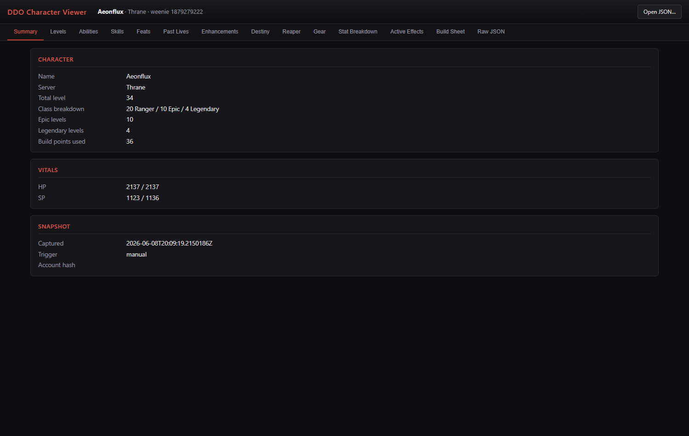

### Levels
Level-by-level class progression.

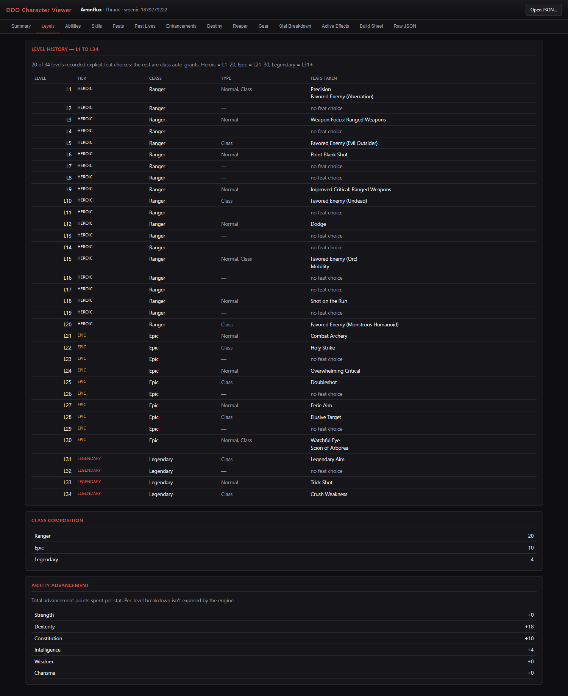

### Abilities
Ability score cards with full per-source breakdowns.

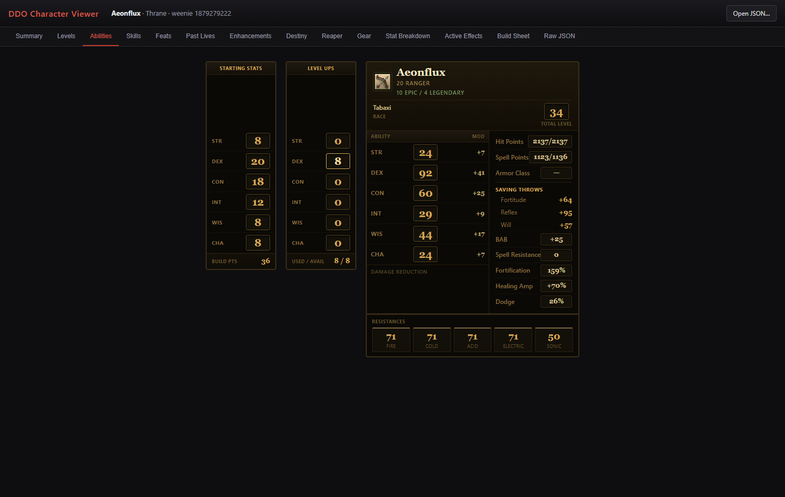

### Skills
Skill ranks and modifier breakdowns.

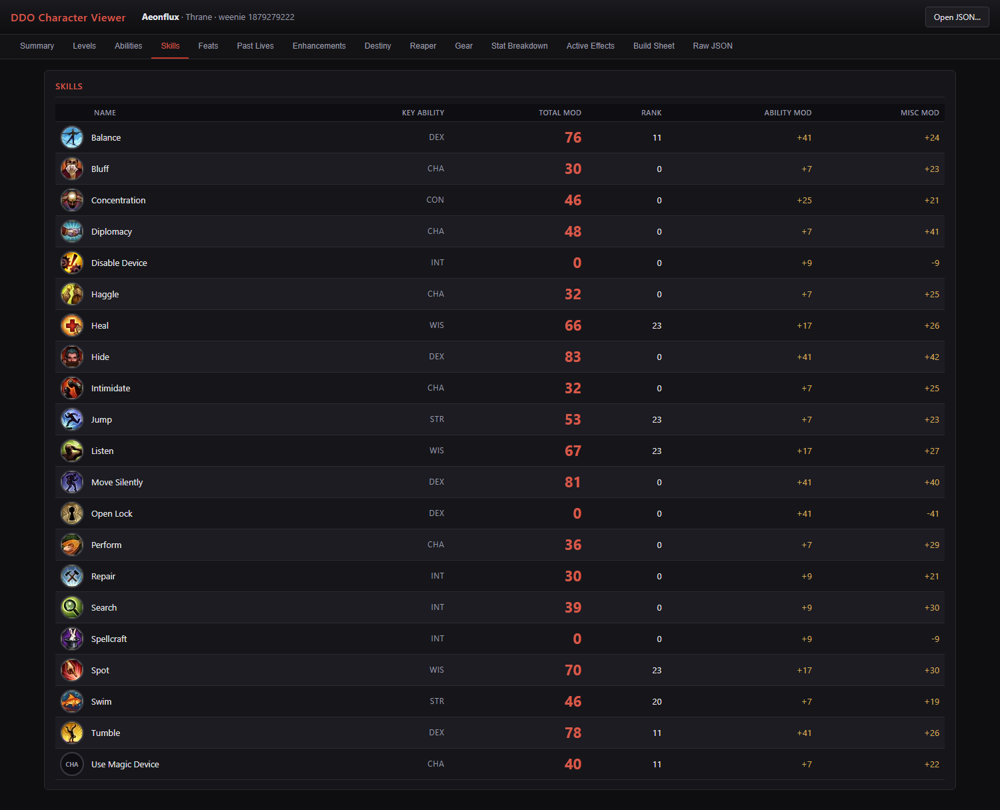

### Feats
All feats with icons and sources.

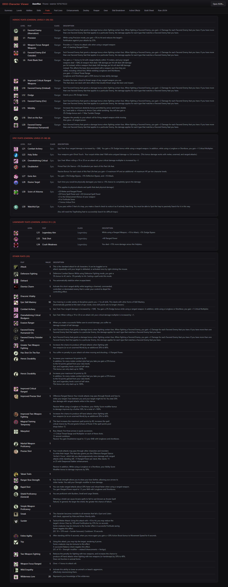

### Past Lives
Heroic, racial, iconic, and epic past lives.

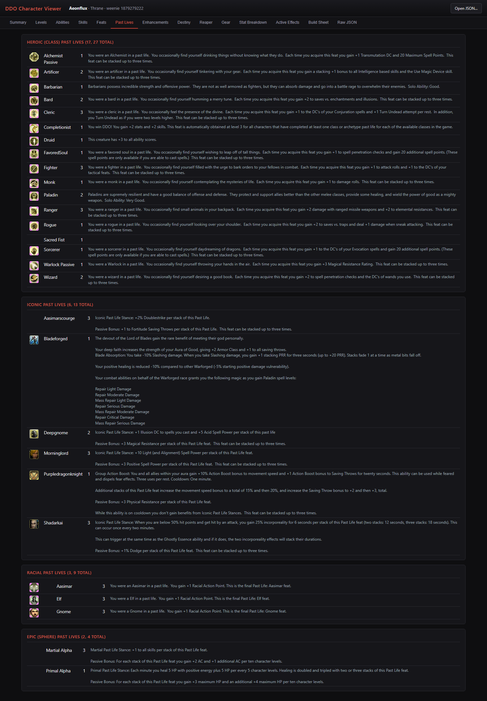

### Enhancements
Full enhancement tree renders — filled cells are your selected enhancements, with current/max rank badges.

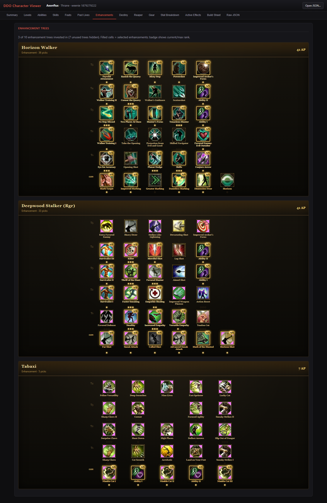

### Destiny
Epic destiny trees with spent destiny points.

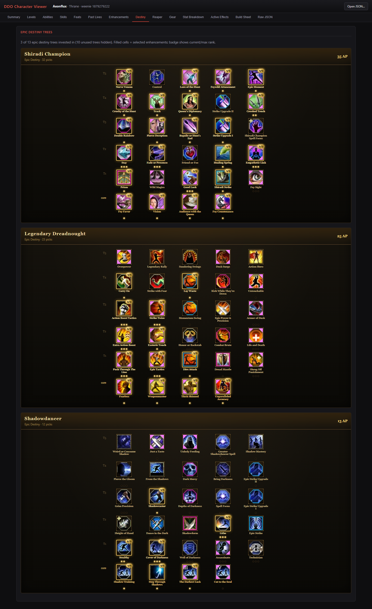

### Reaper
Reaper enhancement trees.

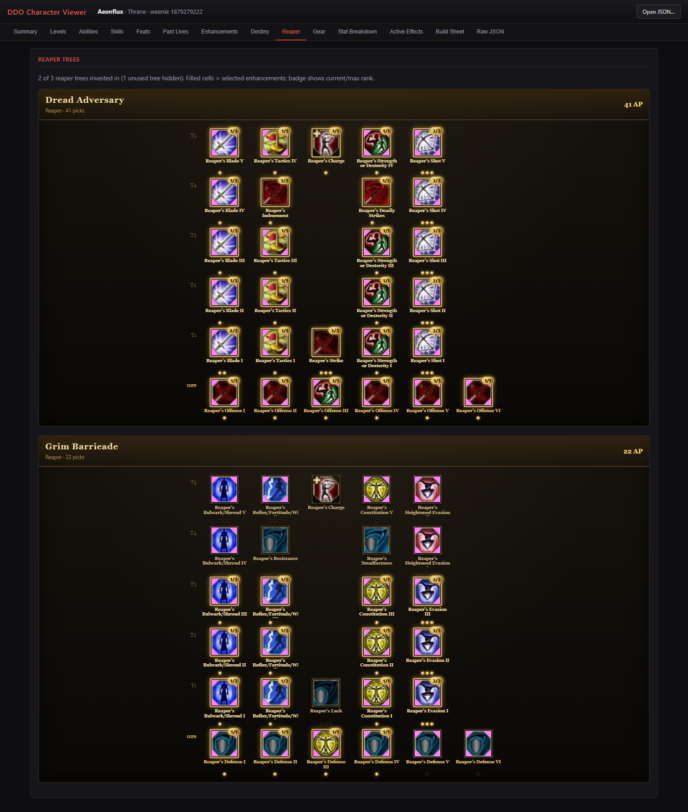

### Gear
Equipped items with effects, augment slots, and active set bonuses.

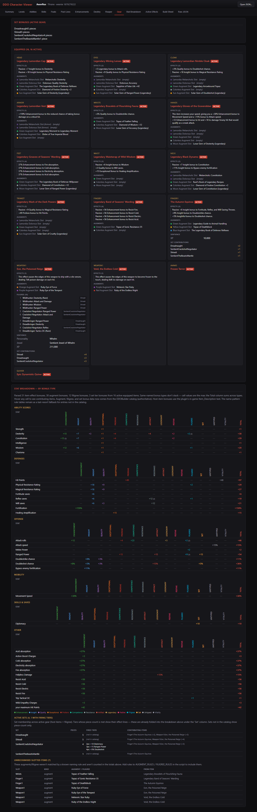

### Stat Breakdown
Computed stat totals with per-bonus-type stacking breakdowns, reconciled against the engine's own aggregates.

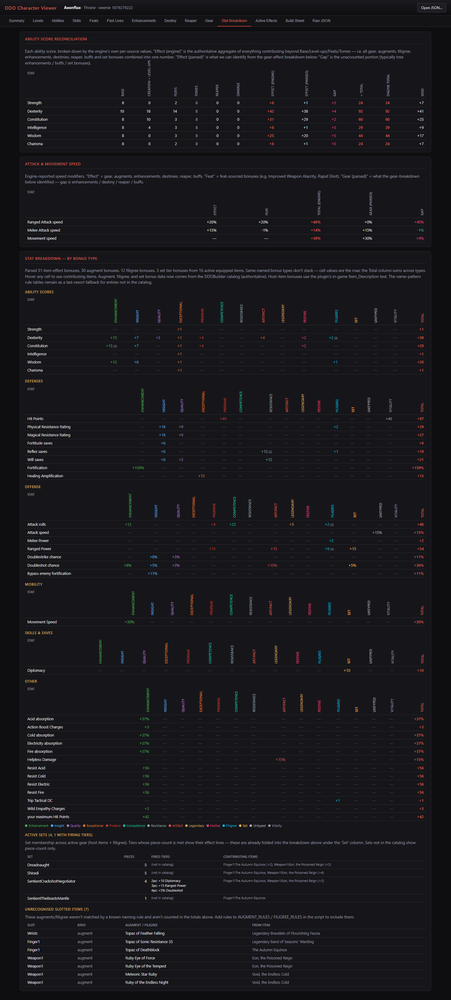

### Active Effects
Every effect currently active on the character.

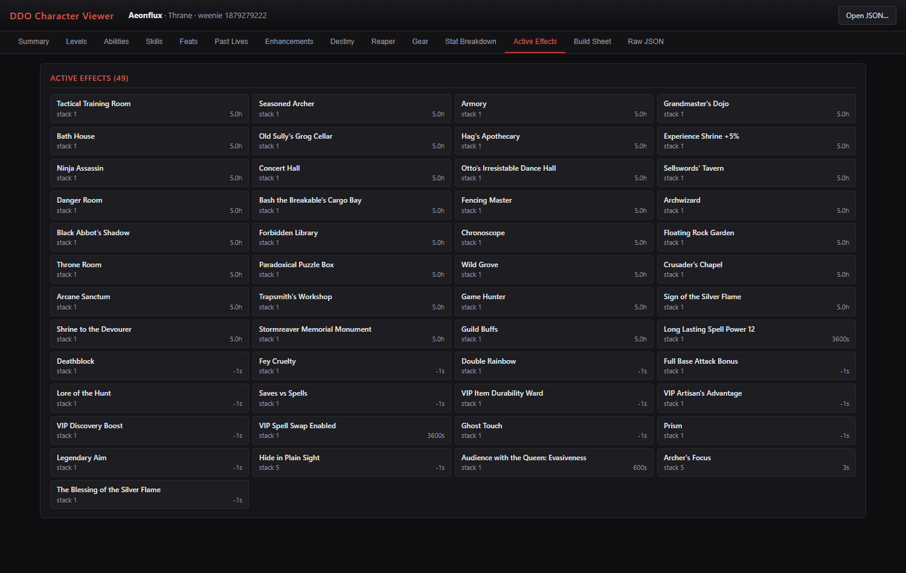

### Build Sheet
A printable, planner-style build sheet — includes a *Print / Save as PDF* button.


### Raw JSON
The full pretty-printed dump for anything the other tabs don't show.

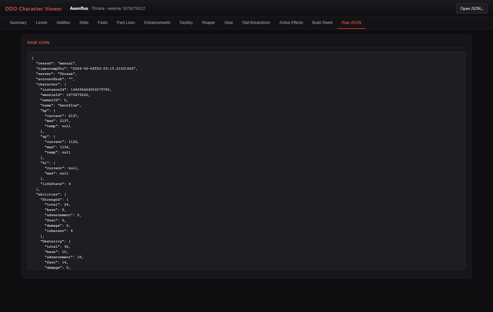

## Installation (prebuilt)

1. Install [Dungeon Helper](https://dungeonhelper.com/) (requires framework **4.2.0.0** or newer).
2. Copy `VoK.CharacterExtractor.dll` and `VoK.CharacterExtractor.metadata` into
   `%AppData%\Dungeon Helper\plugins\CharacterExtractor\`.
3. Restart Dungeon Helper — the plugin appears in its plugin list.
4. Log into DDO. Examine your gear, then press **F12**; the dump lands in the `extracts\` subfolder.
5. Open `DDO_Character_Viewer.html` in a browser and drop the dump onto it.

## Building from source

The plugin source lives in [src/](src/). You need the **.NET 8 SDK** and a Dungeon Helper install (the csproj references `VoK.Sdk.dll` from it):

```
cd src
dotnet build -c Release
```

If Dungeon Helper isn't at `%AppData%\Dungeon Helper\`, override the path:

```
dotnet build -c Release -p:DungeonHelperDir="D:\path\to\Dungeon Helper\"
```

Then copy the two files from `bin\Release\net8.0-windows\` into the plugins folder as above. See [src/README.md](src/README.md) for caveats (SDK signature drift between Dungeon Helper versions).

The [tools/](tools/) scripts regenerate the game-data blobs embedded in the viewer from [DDOBuilder](https://github.com/Maetrim/DDOBuilder)'s `DataFiles/` (download separately): `build_catalog.py` produces the item/augment/set-bonus catalog, `build_game_data.py` the tree topology and icons.

## Repository layout

| Path | Purpose |
|---|---|
| `DDO_Character_Viewer.html` | Self-contained offline viewer (game data + icons embedded) |
| `VoK.CharacterExtractor.dll` | Prebuilt Dungeon Helper plugin |
| `VoK.CharacterExtractor.metadata` | Plugin manifest for Dungeon Helper |
| `src/` | Plugin source (C#, .NET 8, builds against `VoK.Sdk.dll`) |
| `tools/` | Python scripts that rebuild the embedded DDOBuilder catalog/game data |
| `extracts/` | Character dumps written by the plugin (git-ignored) |
| `screenshots/` | Viewer screenshots used in this README |

## Privacy

Dumps are written and viewed **locally only** — the viewer makes no network requests. A dump can include your character name, server, and the names of current party members, so review a JSON before sharing it publicly. The `extracts/` folder is git-ignored by default.

## Credits & licensing

- **[DDOBuilder](https://github.com/Maetrim/DDOBuilder)** by Maetrim — the embedded tree topology, item catalog, game data, and icons are extracted from DDOBuilder's `DataFiles/` (GPLv2). Huge thanks.
- **[Dungeon Helper](https://dungeonhelper.com/)** — the plugin framework and SDK (`VoK.Sdk.dll`) this extractor runs on. The SDK itself is not redistributed here.
- *Dungeons & Dragons Online* © Standing Stone Games. This project is a fan-made tool and is not affiliated with or endorsed by Standing Stone Games or Wizards of the Coast. Game icons and data remain the property of their respective owners.
